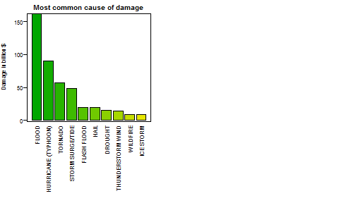

#Summary

#Methods
The analysis was performed in the R language using the following versions and environment 

```r
sessionInfo()
```

```
## R version 3.1.1 (2014-07-10)
## Platform: x86_64-w64-mingw32/x64 (64-bit)
## 
## locale:
## [1] LC_COLLATE=English_United Kingdom.1252 
## [2] LC_CTYPE=English_United Kingdom.1252   
## [3] LC_MONETARY=English_United Kingdom.1252
## [4] LC_NUMERIC=C                           
## [5] LC_TIME=English_United Kingdom.1252    
## 
## attached base packages:
## [1] stats     graphics  grDevices utils     datasets  methods   base     
## 
## other attached packages:
## [1] knitr_1.7
## 
## loaded via a namespace (and not attached):
## [1] digest_0.6.4    evaluate_0.5.5  formatR_1.0     htmltools_0.2.6
## [5] rmarkdown_0.3.3 stringr_0.6.2   tools_3.1.1     yaml_2.1.13
```

The original data file was available from the Coursera website, and downloaded into the local R directory for the project

```r
download.file("http://d396qusza40orc.cloudfront.net/repdata%2Fdata%2FStormData.csv.bz2","repdata_data_StormData.csv.bz2")
```

Read in the file, headers first, then selected

```r
stormData <- read.csv("repdata_data_StormData.csv.bz2",nrows=2)
grep("EVTYPE|FATALITIES|INJURIES|PROPDMG|PROPDMGEXP|CROPDMG|CROPDMGEXP",names(stormData))
```

```
## [1]  8 23 24 25 26 27 28
```


```r
stormData <- read.csv("repdata_data_StormData.csv.bz2",colClasses=c(rep("NULL",7),"character",rep("NULL",14),rep("numeric",3),"character","numeric","character",rep("NULL",9)))
```

Gets you the full data set in stormData ready to process

Copy EVTYPE as a character vector and attach to stormData then create two data arrays containing only the health data and damage data


```r
names(stormData) <- c("Event","Fatalities","Injuries","Property.Damage","PropExp","Crop.Damage","CropExp") # Rename columns 
stormData$Event <- toupper(stormData$Event) # Set events to upper case
stormData <- stormData[stormData$Fatalities>0|stormData$Injuries>0|stormData$Property.Damage>0|stormData$Crop.Damage>0,] #Select only cases with Fatality.Injury or Damage
```


Now we need to refine the events. First, use a visual check to put right the most obvious


```r
allEvents <- stormData$Event # Separate the event data ito a separate variable for ease of reading
# From a visual inspection of the events in the file, correct the most obvious to the standard
allEvents[grep("TSTM|THUNDER",allEvents)]="THUNDERSTORM"
allEvents[grep("TORNADO",allEvents)]="TORNADO"
allEvents[grep("FLASH",allEvents)]="FLASH"
allEvents[grep("FLOOD",allEvents)]="FLOOD"
allEvents[grep("FLASH",allEvents)]="FLASH FLOOD"
allEvents[grep("EXCESSIVE HEAT|EXTREME HEAT|HEAT WAVE",allEvents)]="EXTREMETEMP"
allEvents[grep("EXTREMETEMP",allEvents)]="EXTREME HEAT"
allEvents[grep("HAIL",allEvents)]="HAIL"
allEvents[grep("MICROBURST",allEvents)]="HIGH WIND"
allEvents[grep("SNOW",allEvents)]="HEAVY SNOW"
allEvents[grep("HURRICANE",allEvents)]="HURRICANE (TYPHOON)"
allEvents[grep("ICE STORM",allEvents)]="ISTORM"
allEvents[grep("ICE",allEvents)]="WINTER WEATHER"
allEvents[grep("ISTORM",allEvents)]="ICE STORM"
# Reduced event types now at 231
```
This process reduces the number of event types from 447 down to 212


The remaining strings can be converted into the standard by use of stringdist Ref1


```r
standardEvents <- read.table("events.txt",sep="\t") #read the ile
standardEvents <- toupper(standardEvents$V1)  # convert ti a character array
library("stringdist", lib.loc="D:/Programs/R/R-3.1.1/library") #load stringdist
for (i in 1:length(allEvents))  # convert allEvents 
        {
        allEvents[i]=standardEvents[match(min(stringdist(allEvents[i],standardEvents)),stringdist(allEvents[i],standardEvents))]
        }
```

This process reduces the number of event types to 45

Now look at the fatalities


```r
stormData$Events <- as.factor(allEvents)
fatalities <- tapply(stormData$Fatalities,stormData$Events,sum)
injuries <- tapply(stormData$Injuries,stormData$Events,sum)
fatalities=data.frame(as.numeric(fatalities),as.factor(names(fatalities)))
names(fatalities)=c("Fatalities","Event")
fatalities=fatalities[order(-fatalities[1]),]
injuries=data.frame(as.numeric(injuries),as.factor(names(injuries)))
names(injuries)=c("Injuries","Event")
injuries=injuries[order(-injuries[1]),]
```

And economic effects


```r
stormData$PropExp[grep("h|H|2",stormData$PropExp)] <- "100"
stormData$CropExp[grep("h|H|2",stormData$CropExp)] <- "100"
stormData$PropExp[grep("k|K|3",stormData$PropExp)] <- "1000"
stormData$CropExp[grep("k|K|3",stormData$CropExp)] <- "1000"
stormData$PropExp[grep("4",stormData$PropExp)] <- "10000"
stormData$CropExp[grep("4",stormData$CropExp)] <- "10000"
stormData$PropExp[grep("5",stormData$PropExp)] <- "100000"
stormData$CropExp[grep("5",stormData$CropExp)] <- "100000"
stormData$PropExp[grep("m|M|6",stormData$PropExp)] <- "1000000"
stormData$CropExp[grep("m|M|6",stormData$CropExp)] <- "1000000"
stormData$PropExp[grep("7",stormData$PropExp)] <- "10000000"
stormData$CropExp[grep("7",stormData$CropExp)] <- "10000000"
stormData$PropExp[grep("b|B",stormData$PropExp)] <- "1000000000"
stormData$CropExp[grep("b|B",stormData$CropExp)] <- "1000000000"
stormData$PropExp <- as.numeric(stormData$PropExp)
stormData$CropExp <- as.numeric(stormData$CropExp)
stormData$PropExp[is.na(stormData$PropExp)] <- 0
stormData$CropExp[is.na(stormData$CropExp)] <- 0
stormData$Property.Damage <- stormData$Property.Damage*stormData$PropExp
stormData$Crop.Damage <- stormData$Crop.Damage*stormData$CropExp
totalDamage <- tapply((stormData$Property.Damage+stormData$Crop.Damage),stormData$Events,sum)
totalDamage <- data.frame(as.numeric(totalDamage),as.factor(names(totalDamage)))
names(totalDamage) <- c("Cost","Event")
totalDamage <- totalDamage[order(-totalDamage[1]),]
totalDamage <- head(totalDamage,10)
totalDamage$Cost=totalDamage$Cost/10^9
```


#Results


```r
palette(terrain.colors(20))
par(mfrow=c(1,2),mar=c(12, 4, 2, 4),mgp=c(3,2/3,0))
par(cex=0.67)
fatalities=head(fatalities,10)
barplot(fatalities$Fatalities,names=as.character(fatalities$Event),col=c(1:10),las=2,width=1,main="Most common cause of fatality",ylab="Fatalities")
box()
injuries=head(injuries,10)
barplot(injuries$Injuries,names=as.character(injuries$Event),col=c(1:10),las=2,width=1,main="Most common cause of injury",ylab="Injuries")
box()
```

 

```r
barplot(totalDamage$Cost,names=as.character(totalDamage$Event),col=c(1:10),las=2,width=1,main="Most common cause of damage",ylab="Damage in billion $")
box()
```

 


#Conclusions


#References
1. https://d396qusza40orc.cloudfront.net/repdata%2Fdata%2FStormData.csv.bz2

2. NATIONAL WEATHER SERVICE INSTRUCTION 10-1605, AUGUST 17, 2007, STORM DATA PREPARATION.National Oceanic & Atmospheric Administration

3. M.P.J. van der Loo (2014). The stringdist package for approximate string matching. R Journal 6(1) pp 111-122

