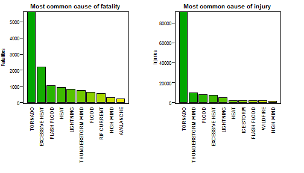
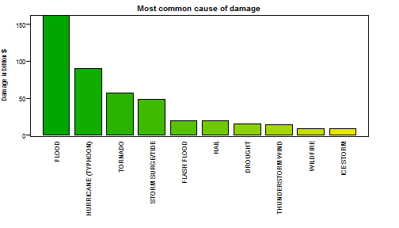

### Synopsis

This report describes an investigation of the NOAA Storm Database (Ref. 1), that seeks to determine the overall effect of stormy weather across the United States, in terms of both the effects on human health, and also their economic effects.

Using a copy of the database, the data were interrogated and the specific totals of fatalities and injuries were isolated by the NOAA's categorisation of storm types. Similarly, the costs of damage to both property and crops were determined for the same categories of storm, and added to determine the overall cost of each event. Results are presented showing the ten most harmful types of storm for each of the three categories, fatalities, injuries and costs.

The data show that Tornados are the most harmful to human health, both in terms of fatalities and injuries, whilst flooding was the most costly to property and crops.  


### Data Analysis  


The analysis was performed in the R language using the following versions and environment.  


```r
sessionInfo()
```

```
## R version 3.1.1 (2014-07-10)
## Platform: x86_64-w64-mingw32/x64 (64-bit)
## 
## locale:
## [1] LC_COLLATE=English_United Kingdom.1252 
## [2] LC_CTYPE=English_United Kingdom.1252   
## [3] LC_MONETARY=English_United Kingdom.1252
## [4] LC_NUMERIC=C                           
## [5] LC_TIME=English_United Kingdom.1252    
## 
## attached base packages:
## [1] stats     graphics  grDevices utils     datasets  methods   base     
## 
## other attached packages:
## [1] stringdist_0.8.1 knitr_1.7       
## 
## loaded via a namespace (and not attached):
##  [1] codetools_0.2-8 digest_0.6.4    evaluate_0.5.5  formatR_1.0    
##  [5] htmltools_0.2.6 markdown_0.7.4  mime_0.2        parallel_3.1.1 
##  [9] rmarkdown_0.3.3 stringr_0.6.2   tools_3.1.1     yaml_2.1.13
```

The original data file was available from the Coursera website (Ref.2), and downloaded into the local R directory for the project.  


```r
download.file("http://d396qusza40orc.cloudfront.net/repdata%2Fdata%2FStormData.csv.bz2",
              "repdata_data_StormData.csv.bz2") # Get the file from source
```

From an initial scanning of the file and NOAA documentation, it was noted that the data of interest to this investigation lay in only seven of the original thirty seven columns of data, location, date etc. not being required. These columns describe the type of storm EVTYPE, the numbers of fatalities and injuries FATALITIES and INJURIES, and the damage to property and crops characterised by columns of number and an exponent of the number, in PROPDMG, PROPDMGEXP, CROPDMG and CROPDMGEXP. The appropriate column numbers were determined by reading in the file headers alone.  


```r
stormData <- read.csv("repdata_data_StormData.csv.bz2",nrows=2)
grep("EVTYPE|FATALITIES|INJURIES|PROPDMG|PROPDMGEXP|CROPDMG|CROPDMGEXP",names(stormData)) # Find column numbers of interest
```

```
## [1]  8 23 24 25 26 27 28
```

From this, the required read statement was constructed, and the full set of seven columns of data loaded into the variable stormData.    


```r
stormData <- read.csv("repdata_data_StormData.csv.bz2",colClasses=c(rep("NULL",7),
                "character",rep("NULL",14),rep("numeric",3),"character","numeric",
                "character",rep("NULL",9))) # Read in only the required columns
```


A visual inspection of the data showed two important aspects. Firstly that there were many rows of data with no fatality, injury or damage, and secondly that, despite the NOAA standard of 48 storm types, the event type data had more than 900 different values.

The first process applied to the data was to choose only those rows of data that had at least one fatality, injury or cost associated with it. At this point, the data fields were also renamed for convenience, and the storm type data set to be upper case.    


```r
names(stormData) <- c("Event","Fatalities","Injuries","Property.Damage","PropExp",
                      "Crop.Damage","CropExp") # Rename columns 
stormData$Event <- toupper(stormData$Event) # Set events to upper case
stormData <- stormData[stormData$Fatalities>0|stormData$Injuries>0|stormData$Property.Damage>0|stormData$Crop.Damage>0,]
                   #Select only cases with Fatality.Injury or Damage
```


The second process involved renaming the type of event, in order to reduce the widely varying style of data entry, and try to approach the NOAA standard. A visual inspection of the various event types showed this to be fairly complicated for a purely automated process. Therefore, the most obvious changes were selected, and coded as a separate pass through the data, in order to bring them into a more ordered state prior to using an automated method.  


```r
allEvents <- stormData$Event # Separate the event data ito a separate variable for ease of reading
# From a visual inspection of the events in the file, correct the most obvious to the standard
allEvents[grep("TSTM|THUNDER",allEvents)]="THUNDERSTORM"
allEvents[grep("TORNADO",allEvents)]="TORNADO"
allEvents[grep("FLASH",allEvents)]="FLASH"
allEvents[grep("FLOOD",allEvents)]="FLOOD"
allEvents[grep("FLASH",allEvents)]="FLASH FLOOD"
allEvents[grep("EXCESSIVE HEAT|EXTREME HEAT|HEAT WAVE",allEvents)]="EXTREMETEMP"
allEvents[grep("EXTREMETEMP",allEvents)]="EXTREME HEAT"
allEvents[grep("HAIL",allEvents)]="HAIL"
allEvents[grep("MICROBURST",allEvents)]="HIGH WIND"
allEvents[grep("SNOW",allEvents)]="HEAVY SNOW"
allEvents[grep("HURRICANE",allEvents)]="HURRICANE (TYPHOON)"
allEvents[grep("ICE STORM",allEvents)]="ISTORM"
allEvents[grep("ICE",allEvents)]="WINTER WEATHER"
allEvents[grep("ISTORM",allEvents)]="ICE STORM"
# Reduced event types now at 231
```

This process reduced the number of event types in the remaining data from 447 down to 212

In order to convert the remaining data into the standard NOAA nomenclature, it was decided to use the 'stringdist' package, which uses a fuzzy logic approach to string matching (Ref. 3).

Firstly, it was necessary to specify the NOAA standards as a variable. This was done by copying the appropriate lines of Ref.1, and creating a text file of the standard names as follows.


```r
read.table("events.txt",sep="\t")
```

```
##                          V1
## 1     Astronomical Low Tide
## 2                 Avalanche
## 3                  Blizzard
## 4             Coastal Flood
## 5           Cold/Wind Chill
## 6               Debris Flow
## 7                 Dense Fog
## 8               Dense Smoke
## 9                   Drought
## 10               Dust Devil
## 11               Dust Storm
## 12           Excessive Heat
## 13  Extreme Cold/Wind Chill
## 14              Flash Flood
## 15                    Flood
## 16             Frost/Freeze
## 17             Funnel Cloud
## 18             Freezing Fog
## 19                     Hail
## 20                     Heat
## 21               Heavy Rain
## 22               Heavy Snow
## 23                High Surf
## 24                High Wind
## 25      Hurricane (Typhoon)
## 26                Ice Storm
## 27         Lake-Effect Snow
## 28          Lakeshore Flood
## 29                Lightning
## 30              Marine Hail
## 31         Marine High Wind
## 32       Marine Strong Wind
## 33 Marine Thunderstorm Wind
## 34              Rip Current
## 35                   Seiche
## 36                    Sleet
## 37         Storm Surge/Tide
## 38              Strong Wind
## 39        Thunderstorm Wind
## 40                  Tornado
## 41      Tropical Depression
## 42           Tropical Storm
## 43                  Tsunami
## 44             Volcanic Ash
## 45               Waterspout
## 46                 Wildfire
## 47             Winter Storm
## 48           Winter Weather
```

Reading in this table, it was possible to use the 'stringdist' function to rename the remaining storm events to the standard. The time constraints of the project meant that it was not possible to confirm exactly the accuracy of this process, however, the combination of the first pass, above, and the 'stringdist' calculation is not expected to be significantly in error.  


```r
standardEvents <- read.table("events.txt",sep="\t") # Read the file of NOAA standard events
standardEvents <- toupper(standardEvents$V1)  # Convert to an uppercase character array
library("stringdist", lib.loc="D:/Programs/R/R-3.1.1/library") # Load the stringdist package
for (i in 1:length(allEvents))  # convert allEvents 
        {
        allEvents[i]=standardEvents[match(min(stringdist(allEvents[i],standardEvents)),
                                          stringdist(allEvents[i],standardEvents))]
        # Examine and reset allEvents to the closest calculated standard event
        }
```

This process reduced the number of event types to 45

Having prepared the data to contain only events of interest to the investigation, and characterising them to the NOAA standard, analysis was begun.

The first analysis created two variables of the total numbers of fatalities and injuries, calculated by event type. These variables were then sorted in decreasing order of fatality and injury, and the top ten event types injurious to health were selected to display.


```r
stormData$Events <- as.factor(allEvents)  # Make Events a factor based on the recalculated event types
fatalities <- tapply(stormData$Fatalities,stormData$Events,sum) # Create list of sums by event for fatalities
injuries <- tapply(stormData$Injuries,stormData$Events,sum)     # Create list of sums by event for injuries
fatalities=data.frame(as.numeric(fatalities),as.factor(names(fatalities))) # Make into a data frame
names(fatalities)=c("Fatalities","Event") # Rename columns
fatalities=fatalities[order(-fatalities[1]),] # Order by decreasing number
injuries=data.frame(as.numeric(injuries),as.factor(names(injuries))) # Repeat process for injuries
names(injuries)=c("Injuries","Event")
injuries=injuries[order(-injuries[1]),]
fatalities=head(fatalities,10) # Select only the top ten values for plotting
injuries=head(injuries,10)
```

A similar analysis was made for the economic effects, but before that could be achieved, the damage values had to be correctly calculated by combining the entered numbers with their appropriate exponent value. Having dome that, the total economic cost was calculated as the sum of both property and crop damage, and divided by 10^9 to return a sum in billions of dollars. As before, the ten most expensive storm types were selected for display.


```r
stormData$PropExp[grep("h|H|2",stormData$PropExp)] <- "100"  # Convert all EXP characters to numbers
stormData$CropExp[grep("h|H|2",stormData$CropExp)] <- "100"  # For both Property and Crop data
stormData$PropExp[grep("k|K|3",stormData$PropExp)] <- "1000"
stormData$CropExp[grep("k|K|3",stormData$CropExp)] <- "1000"
stormData$PropExp[grep("4",stormData$PropExp)] <- "10000"
stormData$CropExp[grep("4",stormData$CropExp)] <- "10000"
stormData$PropExp[grep("5",stormData$PropExp)] <- "100000"
stormData$CropExp[grep("5",stormData$CropExp)] <- "100000"
stormData$PropExp[grep("m|M|6",stormData$PropExp)] <- "1000000"
stormData$CropExp[grep("m|M|6",stormData$CropExp)] <- "1000000"
stormData$PropExp[grep("7",stormData$PropExp)] <- "10000000"
stormData$CropExp[grep("7",stormData$CropExp)] <- "10000000"
stormData$PropExp[grep("b|B",stormData$PropExp)] <- "1000000000"
stormData$CropExp[grep("b|B",stormData$CropExp)] <- "1000000000"
stormData$PropExp <- as.numeric(stormData$PropExp)  # Make numeric
stormData$CropExp <- as.numeric(stormData$CropExp)  
stormData$PropExp[is.na(stormData$PropExp)] <- 0    # Replace numeric data with 0
stormData$CropExp[is.na(stormData$CropExp)] <- 0
stormData$Property.Damage <- stormData$Property.Damage*stormData$PropExp # Calulate full damage values
stormData$Crop.Damage <- stormData$Crop.Damage*stormData$CropExp
totalDamage <- tapply((stormData$Property.Damage+stormData$Crop.Damage),stormData$Events,sum) 
                # Calculate combined total damage data
totalDamage <- data.frame(as.numeric(totalDamage),as.factor(names(totalDamage))) # Make into a data frame
names(totalDamage) <- c("Cost","Event")  # Rename
totalDamage <- totalDamage[order(-totalDamage[1]),] #Order the data
totalDamage <- head(totalDamage,10) # Select only the top ten values for plotting
totalDamage$Cost=totalDamage$Cost/10^9 # Convert values into billions
```


### Results

The results of the analysis are presented in the following graphs.

**Figure 1 Effects on health of the different storm types**

```r
palette(terrain.colors(20))  # Set plotting properties
par(mfrow=c(1,2),mar=c(12, 4, 2, 4),mgp=c(3,2/3,0))
par(cex=0.67)
barplot(fatalities$Fatalities,names=as.character(fatalities$Event),col=c(1:10),
        las=2,width=1,main="Most common cause of fatality",ylab="Fatalities") #Plot fatalities
box()
barplot(injuries$Injuries,names=as.character(injuries$Event),col=c(1:10),
        las=2,width=1,main="Most common cause of injury",ylab="Injuries") # Plot injuries
box()
```

 


**Figure 2 The economic effects of the different storm types**

```r
par(mar=c(12, 4, 2, 4),mgp=c(3,2/3,0))
par(cex=0.67)
barplot(totalDamage$Cost,names=as.character(totalDamage$Event),col=c(1:10),
        las=2,width=1,main="Most common cause of damage",ylab="Damage in billion $") # Plot damage
box()
```

 

From the above plots it is clear that Tornados are the most prejudicial to health, being twice as likely to produce fatalities, and an order of magnitude more likely to cause injury than other types. The second most dangerous event in terms of fatality is excess heat, a feature that might help to determine future policy regarding energy emissions.

Flooding is the most expensive event in terms of purely economic cost to property and crops, although this figure does not reflect the high cost of human injury and fatality, which may be a weakness of the data without adding this in to the overall cost to the US. The second most costly storm type is the Hurricane, in terms of physical damage.


### Conclusions

The analysis of the NOAA Storm Database shows that Tornados are the most dangerous storms encountered in the US with regard to human health, with excessive heat being the second most likely cause of death due to weather. Tornados are an order of magnitude more likely to cause non-fatal injury than any other storm type.

In terms of direct cost, flooding is the most expensive event, followed by Hurricanes and Tornados.

The analysis highlighted some weaknesses of the database. Firstly, despite the NOAA guidelines, the reported type of event varies greatly from the required 48 types, and any brief analysis may be prone to wongly categorising some of the events, without significant effort. Secondly, the cost of storms to the US is only measured in cash terms. In order to analyse the true cost to the economy some estimate of the financial effects of fatalities and injury should be added.  

### References

1. NATIONAL WEATHER SERVICE INSTRUCTION 10-1605, AUGUST 17, 2007, STORM DATA PREPARATION.National Oceanic & Atmospheric Administration

2. https://d396qusza40orc.cloudfront.net/repdata%2Fdata%2FStormData.csv.bz2

3. M.P.J. van der Loo (2014). The stringdist package for approximate string matching. R Journal 6(1) pp 111-122

